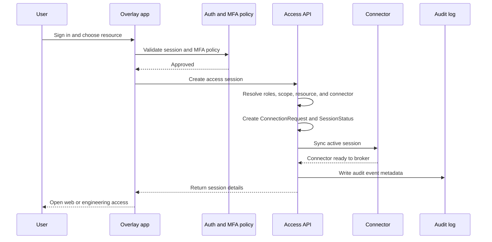

# Connector Architecture and Session Flow

This appendix explains the current repo-backed connectivity model in more technical terms.

## Connector Architecture

The repo describes a `Connector` as a Kubernetes pod that usually includes multiple containers:

- Envoy
- Guacd
- the connector app from this repo
- a VPN-style sidecar such as OpenVPN or WireGuard with the capabilities needed to manage network access

Together, these components broker connectivity between the user-facing application and the target resource behind the connector's access path.

At a high level:

- the control plane determines who can access what
- the connector app configures brokering behavior for current connection requests
- Envoy and Guacd handle traffic brokering for supported access modes
- the VPN-style sidecar or equivalent network component provides the underlying reachability when needed

## Current Session Lifecycle

The current access flow in the repo supports a buyer-facing claim set centered on named-user session creation, policy checks, and audited brokering.

1. The user authenticates to Overlay.
2. The access API resolves the active organization and the user's `RoleAssignment` set.
3. MFA policy is enforced before access proceeds.
4. The selected `HeadEnd`, `Controller`, or `Machine` is resolved within the user's allowed scope.
5. Overlay creates a `ConnectionRequest` tied to the user, connector, target host, target port, protocol, and expiry.
6. A `SessionStatus` path is returned for the session.
7. The system syncs the relevant `Connector` so it can broker the active request.
8. For engineering access, Overlay can optionally apply an IP-based restriction if organization policy and client IP resolution allow it.
9. Audit metadata is attached to the session-creation response path.
10. Connector access logs provide broker-layer evidence for resulting traffic.

## Current Security Controls Evidenced In Repo Behavior

These controls are grounded in the current codebase and are safe to describe as present behavior:

- Scoped roles across tenant, customer, and site boundaries through `RoleAssignment`
- MFA policy enforcement during access-sensitive API flows
- Per-session audit events attached to access actions
- Connector access-log retrieval for tenant-admin review
- Optional engineering-session IP restriction based on organization policy and client IP resolution

These are important because they show Overlay's control plane is not just a launch pad for connectivity. It is an enforcement point before the connector is asked to broker anything.

## Why The Connector Matters

The connector is the operational bridge between identity-driven access decisions and the real connectivity path to the target resource.

That allows Overlay to:

- keep user interaction centered on resources and sessions
- tolerate different underlying connectivity methods per estate
- expose a more uniform control surface to buyers and operators
- preserve broker-layer evidence in the access path

## Session Sequence

## Evidence Boundary

This appendix deliberately stays inside claims supported by the repo. It does not assume:

- continuous live monitoring beyond the documented on-demand model
- undocumented policy controls
- undocumented device-level enforcement beyond the connector-brokered flow

That distinction matters for buyers. The current model is already strong without needing inflated claims.
