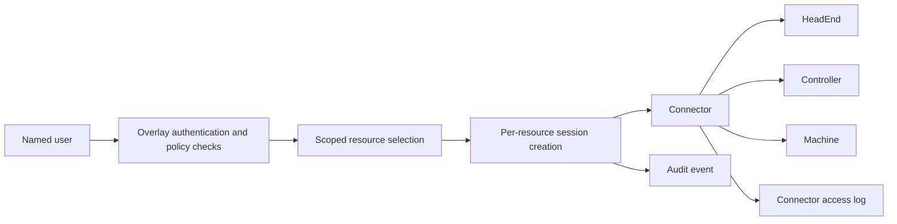

# Identity-Based Connectivity Model

Overlay is designed to give BMS teams remote access without forcing every engineer to operate like a network administrator.

In many BMS estates, remote access still depends on a patchwork of site VPNs, jump hosts, shared controller credentials, and ad hoc firewall rules. That model creates friction for engineers and operational risk for buyers. Users often inherit broad network reach when they only need one head-end, one controller, or one machine. Access paths are inconsistent from site to site. Auditing is fragmented. Offboarding and policy enforcement are difficult because access is tied to network plumbing as much as to user identity.

Overlay uses a different model. Access begins with the user, not the tunnel. A named user signs in, organization policy is evaluated, a specific resource is selected, a session is created for that resource, and a connector brokers the resulting access path. The practical outcome is that access is attached to identity, scope, and session context instead of being granted as general network presence.

## The Buyer Problem In BMS

Traditional remote access in BMS environments usually creates one or more of these problems:

- engineers switch between multiple VPN clients across customer estates
- access is often broad at the subnet or site level rather than tied to a named task
- shared remote-access credentials are hard to rotate and even harder to govern
- site-specific VPN behavior creates support overhead and slows onboarding
- audit evidence is incomplete because identity events and network events live in different places

For a security and operations buyer, the issue is not just convenience. It is control. The question is whether access is granted to a named person for a defined resource and session, or whether the organization is effectively handing out partial network membership and hoping operational process closes the gap.

## How Overlay's Model Works

Overlay keeps the access experience simple for the user while keeping identity and policy central to the control plane.

1. A user authenticates to Overlay.
2. Organization rules such as MFA policy are enforced.
3. The user's scoped access determines which sites and resources they can reach.
4. The user starts a session for a specific `HeadEnd`, `Controller`, or `Machine`.
5. Overlay creates a `ConnectionRequest` for that target and instructs the relevant `Connector`.
6. The connector brokers traffic only for that session and target.
7. The session and resulting activity can be audited.

This is why Overlay is best described as identity-based connectivity rather than a general-purpose site VPN. The connector can use existing site connectivity mechanisms under the hood, but the user experience and the authorization model stay centered on identity, scope, and session creation.

## What This Means Operationally

- Access can be tied to a named user rather than a shared tunnel credential.
- Access starts from a specific resource request rather than blanket network reach.
- Controls such as MFA policy and role scope are evaluated before a session is created.
- Audit records can be attached to the user action that initiated access.
- Connector-level access logs provide another layer of evidence at the broker point.

## Glossary

- `Connector`: A deployed broker that provides connectivity between Overlay users and resources behind a site network or other access path.
- `Session`: A time-bounded access instance created for a specific resource and access mode such as web or engineering.
- `Resource`: The target being accessed, such as a `HeadEnd`, `Controller`, or `Machine`.
- `Scope`: The level at which a user's role applies, such as tenant, customer, or site.
- `Audit`: The record of who initiated an action, whether it succeeded, and the relevant scope and metadata.
- `IP lock`: An optional engineering-session restriction that limits access to the client's current source IP range when it can be resolved.

## System Context

## Why Buyers Use This Framing

The value is not that Overlay eliminates every underlying network technology. The value is that it standardizes how access is granted, constrained, and evidenced across those technologies. For a buyer, that is the difference between managing a growing collection of site-specific exceptions and operating a consistent access model across the estate.
