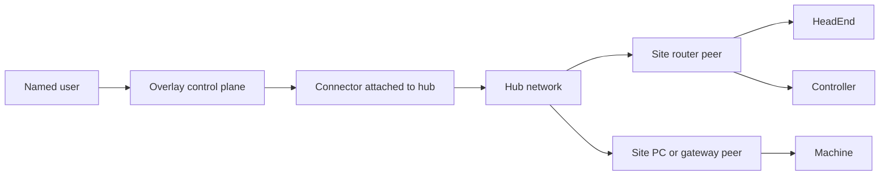

# Managed Network Extension

This document explains how the managed hub-and-router model extends the same identity-first approach when a customer does not already have suitable site connectivity for the connector to use.

## Why This Extension Exists

Some customer estates already have an access method that a connector can use, such as an existing VPN or equivalent path. Others do not. In those cases, the managed network concept provides a way to establish reachability without changing the core buyer story.

The goal is not to replace the identity-based model. The goal is to give that model a standardized network underlay when the estate lacks one.

## How It Extends The Existing Model

The planned hub-and-router approach keeps the same operating pattern:

- users still authenticate to Overlay as named identities
- access is still initiated as a session to a specific resource
- a `Connector` still brokers access for the user-facing workflow
- the managed network provides site reachability under that broker layer

In repo terms, the extension introduces:

- a tenant-specific `HubNetwork`
- site-side router peers represented as `HubRouter`
- a connector associated with the hub so Overlay can still broker access into that managed range

This means the control plane remains stable even when the network foundation changes.

## Buyer Value

For buyers, the extension is important because it preserves a single access model across two situations:

- customers that already have workable site connectivity
- customers that need Overlay to provide the network path as well

That reduces architecture drift across the portfolio and avoids turning special-case connectivity into a separate operating model.

## Topology Overview

## Important Boundary

This extension should be presented as a planned continuation of the same connectivity philosophy, not as a substitute narrative. The main buyer message remains:

- access is identity-led
- access is session-based
- connectors broker the path to specific resources

The managed hub model only changes how reachability is supplied where a suitable customer-controlled path does not already exist.
