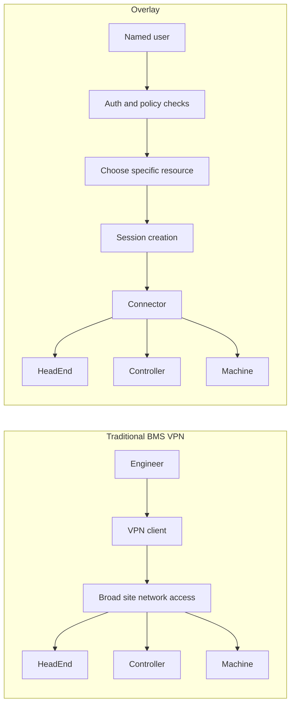

# Overlay vs Traditional BMS VPN

Overlay does not ask the user to become a member of each site network before they can work. It asks the user to authenticate, choose a specific resource, and start a session that a connector brokers on their behalf.

That difference changes both the security model and the operating model.

## Side-By-Side Comparison

| Area | Traditional BMS VPN pattern | Overlay identity-based model |
| --- | --- | --- |
| Trust boundary | User is often placed onto a site network or large subnet | User requests access to a specific resource and session |
| Access scope | Commonly broad, network-oriented, and hard to normalize across sites | Resource-oriented and scoped through role assignments and session creation |
| Credentials | Per-site VPN credentials, shared accounts, or controller credentials are common | User signs into Overlay as a named identity; session brokering is handled by the platform |
| Deployment model | Site-by-site VPN client variation and operational exceptions | Connector pattern standardizes brokering across different site connectivity types |
| Operator effort | Frequent client switching, credential hunting, and customer-specific instructions | Consistent access workflow regardless of underlying connector type |
| Auditing | Identity events and network access evidence are often fragmented | Session initiation and connector-level activity are closer to the same control path |
| Blast radius | A successful VPN login can create wider network reach than needed for the task | Access is created for the requested resource and session rather than general network presence |

## Workflow Comparison

### Traditional VPN Workflow

1. Engineer finds the right customer VPN client or exported profile.
2. Engineer authenticates into the site network.
3. Engineer gains some level of network reach into the estate.
4. Engineer separately discovers the target host, port, and credentials.
5. Audit evidence is spread across VPN logs, device logs, and human process.

### Overlay Workflow

1. Engineer signs into Overlay.
2. Overlay enforces the relevant organization policy such as MFA.
3. Engineer selects the site and the specific `HeadEnd`, `Controller`, or `Machine`.
4. Overlay creates a session and maps it to the right `Connector`.
5. The connector brokers the session to the requested target.
6. The action is auditable as a named-user session event, with connector access data available at the broker layer.

## What Overlay Does Not Require From The User

Overlay does not require the user to:

- switch between multiple site VPN clients to reach different customers
- take broad subnet access just to reach one device
- rely on shared remote-access credentials as the primary access model
- understand the underlying connector type before starting a session

## Architecture Contrast

## Buyer Implications

For a security buyer, Overlay reduces dependence on broad site-level access as the default operating posture.

For an operations buyer, Overlay reduces the cost of inconsistency. Engineers can work through one session model even when the underlying connectivity method varies by customer or by site. That is the practical reason the connector approach matters: it decouples the operator workflow from the fragmentation of the field.
